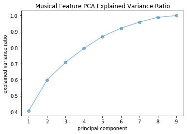
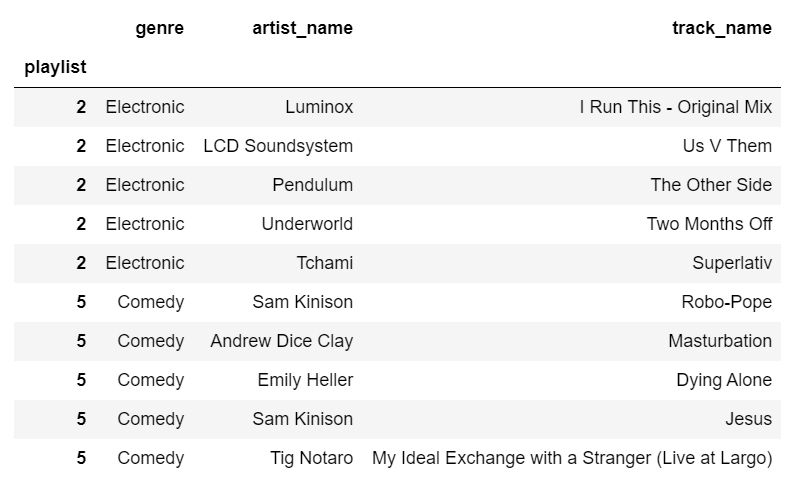
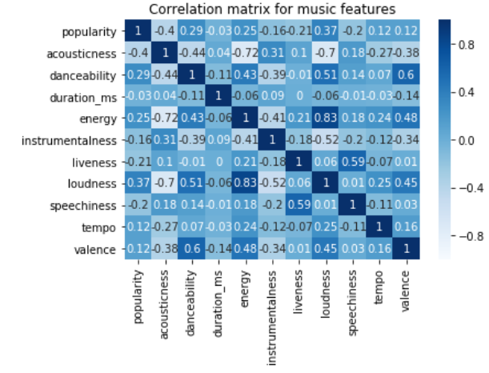
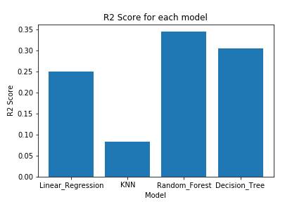
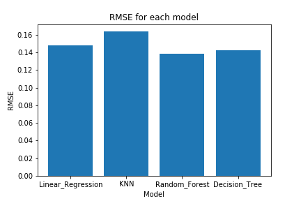

# Spotify Songs Analysis

### Problem Definition

The global music industry was worth over $19 billion in 2018, and there has been recent interest in predicting the popularity of a song based solely on its musical features. Through our research, we found that there have been many similar studies conducted on music and machine learning in recent years. We found studies that trained CRNNs on a combination of the time-series waveform data and musical features data, as well as studies that trained SVM models on features extracted from the songs [2, 3, 5]. In this project, however, we plan to test if a neural network can make accurate predictions using the musical features supplied by the Spotify Dataset [1, 4].

### Data Exploration

The dataset we decided to use contains 228,159 tracks, and provides numerical data on the musical features of each song. Each track is defined by a tuple of (Artist Name, Track Name, Genre, Track ID) and has 10 musical features associated with it. After removing all identifying features, the dataset looks as follows:

We have also provided a brief explanation for each feature:

| Feature          | Explanation                                                                                                                                             |
|------------------|---------------------------------------------------------------------------------------------------------------------------------------------------------|
| Popularity       | Based, in the most part, on the total number of plays the track has had and how recent those plays are.                                                 |
| Acousticness     | A confidence measure from 0.0 to 1.0 of whether the track is acoustic.                                                                                  |
| Danceability     | How suitable a track is for dancing based on a combination of musical elements including tempo, rhythm stability, beat strength, and overall regularity |
| Duration         | Duration in milliseconds.                                                                                                                               |
| Energy           | Energy is a measure from 0.0 to 1.0 and represents a perceptual measure of intensity and activity.                                                      |
| Instrumentalness | Predicts whether a track contains no vocals.                                                                                                            |
| Liveness         | Detects the presence of an audience in the recording.                                                                                                   |
| Loudness         | The overall loudness of a track in decibels (dB).                                                                                                       |
| Speechiness      | Detects the presence of spoken words in a track.                                                                                                        |
| Tempo            | The overall estimated tempo of a track in beats per minute (BPM).                                                                                       |
| Valence          | Describes the musical positiveness conveyed by a track.   

### Unsupervised

The goal of the DBScan unsupervised learning portion was to generate playlists comprised of tracks with similar musical features. To this end, we separated the dataset into the core numerical musical features taking care to filter out identifying labels and classifications such as the track name, artist, and genre. We also removed effectively duplicate tracks based on artist and track name, which reduced the dataset size from ~280,000 to ~150,000 tracks. The resultant list of musical features consisted of acousticness, danceability, energy, instrumentalness, liveness, loudness, speechiness, tempo, and valence.

After standardizing the musical feature data subset, we performed PCA to better understand the underlying data's core composition. It turned out that the explained variance was reasonably well distributed amongst the various musical features with 99% variance explanation requiring 8 of 9 principal components and only ~40% explained by the first component. We capped the number of components at 9 since there were only 9 musical features under consideration. 

Interestingly, the primary component was best described by loudness and energy, which a random sampling of adults above the age of 45 has subsequently confirmed via their ground truth labels.

In order to perform the DBSCAN clustering, we needed to determine relevant values for the  𝑚𝑖𝑛𝑝𝑡𝑠  and  𝜖  variables. We used the  𝑚𝑖𝑛𝑝𝑡𝑠≤𝐷+1  rule of thumb to set  𝑚𝑖𝑛𝑝𝑡𝑠  equal to 10 given that our cleaned dataset consisted of 9 features. We then subjected a random sampling of the dataset to the tried and true "elbow test" by plotting the sorted 10th nearest neighbor distances. Based on the elbow test, we elected to use an  𝜖  value of 0.75 to ensure both a sufficient number of clusters as well as a relatively evenly disbursed track count per cluster.

The resultant clustering consisted of 19 playlists, excluding tracks labeled as noise, comprised of ~90% of the total dataset. The average cluster size consisted of ~7,300 tracks, with each cluster representing ~5% of the total dataset.

Without further adieu, below please find a sample of tracks from some of our DBSCAN generated playlists. Interestingly, despite leaving out the genre and artist name from the cleaned dataset, the DBSCAN clustering grouped together tracks from similar genres and artists based solely on their musical features.

### Supervised

The first step was to take a look at all the features and construct a correlation matrix
to determine if any of the features represented the same meaning as another feature. This
matrix is shown below. Energy and loudness are highly correlated as one might expect. All 
of the features are distinct from each other and will all be useful in the final regression 
models to predict popularity.

Four different regression models were constructed using scikit-learn. These models were 
standard linear regression, k-nearest neighbors, random forest and decision trees. All models
were trained and scored using 10-fold cross validation. Two different scoring metrics were looked
at, R squared value and root mean square error. These scores for each model are shown below. 
Hyperparameter tuning was performed on all of the models to get the best possible scores for each. 
Random forest ended up performing significantly better than all of the other models. 

The next step was to look at all of the features that went into the models are see which feature
ended up being the most useful for the model. This was done by looking at scikit-learn's feature
importance variable and it ended up being that acousticness was by far the most useful to the 
model. Many of the other features were relatively similar in importance to each other and still 
played a significant role in producing the model. The graph below shows the top 10 features. The 
two features that played almost no role in the model were key and time_signature. 

### References

[1] Bertin-Mahieux, T., Ellis, D. P., Whitman, B., & Lamere, P. (2011). The million song dataset.
[2] Choi, K., Fazekas, G., Sandler, M., & Cho, K. (2017). Convolutional recurrent neural
networks for music classification. In IEEE International Conference on Acoustics,
Speech and Signal Processing (ICASSP) (pp. 2392-2396).
[3] J. Lee and J. Lee, "Music Popularity: Metrics, Characteristics, and Audio-Based Prediction," in IEEE Transactions on Multimedia, vol. 20, no. 11, pp. 3173-3182, Nov. 2018.
[4] McFee, B., Bertin-Mahieux, T., Ellis, D. P., & Lanckriet, G. R. (2012). The million song 
dataset challenge. In Proceedings of the 21st International Conference on World Wide 
Web (pp. 909-916). ACM.
[5] Ni, Y., Santos-Rodriguez, R., Mcvicar, M., & De Bie, T. (2011). Hit song science 
once again a science. In 4th International Workshop on Machine Learning and Music.

Current URL: https://deom119.github.io/deom119.github.io-cs7641/
